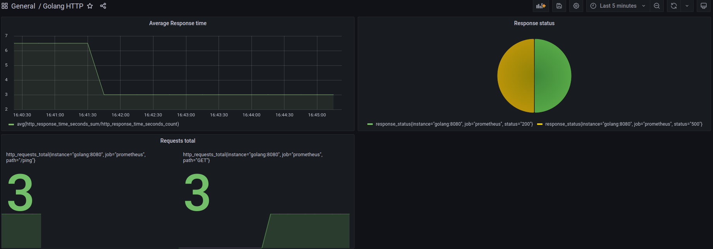

## GO-SKELETON API (Golang + Cqrs + Grafana + Prometheus) 
#### Created by [@saidrkc]("https://github.com/saidrkc")

Go-skeleton is a basic api with most commonly tools for a multipurpose API with observability.
```
- Gin Web http route handling
- CQRS (Command Query Responsibility Segregation)
- Grafana
- Prometheus
``` 

## Installation

Use instructions below for a correct stand up

```bash
make up ## create docker containers
```

### Start from scratch new project
```bash
make bash ## enter to basic go-skeleton
make go-build
make go-test ## run initial tests (unit and end 2 end)
make go-test-unit ## run only unit tests
make go-test-e2e ## run only e2e tests
make go-test-coverage ## run tests and create coverage files
```


## Usage

### Basic Endpoints

```bash
GET http://127.0.0.1:8080/ping
POST http://127.0.0.1:8080/pong
````

### Observability Dashboard
```bash
http://127.0.0.1:9090 - Prometheus
http://127.0.0.1:3000 - Grafana dashboards
```
### 
<a href="http://127.0.0.1:3000/d/1JNOL0aGz/golang-http?orgId=1" target="_blank">Grafana Dashboard</a>


## Contributing
Pull requests are welcome. For major changes, please open an issue first to discuss what you would like to change.

Please make sure to update tests as appropriate.

## License
[MIT](https://mit.com/licenses/mit/)


